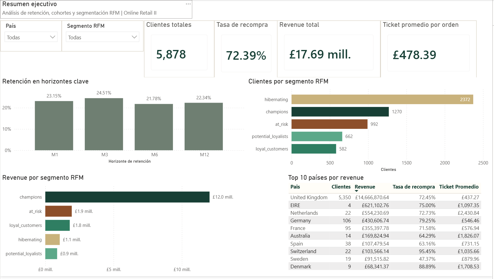
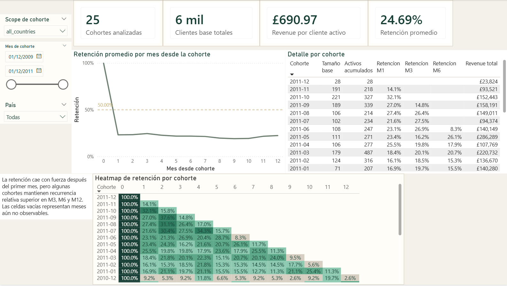
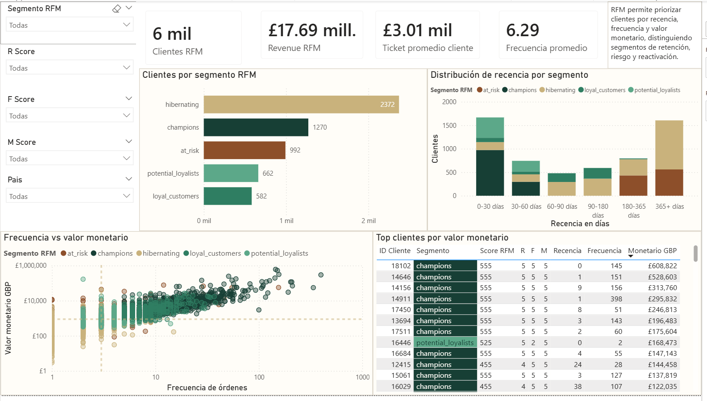

# Analisis de retencion de clientes, cohortes y segmentacion RFM

Caso de estudio end-to-end de analitica de datos aplicado a un ecommerce transaccional real con `Online Retail II`.
El proyecto integra limpieza reproducible, modelado analitico, cohortes, segmentacion RFM y una capa ejecutiva visual documentada para portafolio.

## Resumen del proyecto

Este caso de estudio parte de una pregunta central de negocio: como medir recurrencia, retencion y valor de cliente en una base transaccional historica, distinguiendo entre volumen de compra, persistencia en el tiempo y calidad comercial de la base de clientes.

La solucion se construyo como un flujo reproducible de cinco capas:

- ingesta y estandarizacion del dataset original;
- limpieza analitica con reglas de negocio explicitas;
- construccion de datasets procesados para clientes, cohortes y RFM;
- validacion con notebooks, SQL y pruebas unitarias;
- traduccion de hallazgos a una narrativa ejecutiva con evidencia visual del dashboard.

## Objetivo

Construir un caso de analitica de negocio que permita:

- medir que proporcion de clientes vuelve a comprar;
- analizar como evolucionan las cohortes en el tiempo;
- identificar que segmentos concentran mas valor y mayor riesgo de abandono;
- traducir resultados tecnicos a una lectura ejecutiva clara y accionable.

## Preguntas de negocio

Entre las preguntas principales del caso se encuentran:

- que proporcion de clientes realiza recompra;
- como cambia la retencion segun cohorte de primera compra;
- que paises muestran mejor recurrencia relativa;
- que segmentos combinan mayor valor historico con mayor riesgo de abandono;
- que indicadores deberia seguir un area de negocio para priorizar retencion y reactivacion.

## Stack utilizado

- `Python`
- `SQL`
- `Pandas`
- `Power BI`

## Resultado del proyecto

### Volumen procesado

| Indicador | Valor |
| --- | ---: |
| Filas en ingesta inicial | 1,067,371 |
| Duplicados exactos removidos | 12,133 |
| Filas en base general | 1,055,238 |
| Filas en compras validas | 793,609 |
| Clientes unicos | 5,878 |
| Paises con compras validas | 41 |

### KPIs principales

| KPI | Valor |
| --- | ---: |
| Clientes totales | 5,878 |
| Repeat rate | 72.39% |
| Revenue total | GBP 17,685,460.64 |
| Ticket promedio por orden | GBP 478.39 |
| Retencion M1 | 23.15% |
| Retencion M3 | 24.51% |
| Retencion M6 | 21.78% |
| Retencion M12 | 22.34% |

### Segmentos RFM mas relevantes

| Segmento | Clientes |
| --- | ---: |
| `hibernating` | 2,372 |
| `champions` | 1,270 |
| `at_risk` | 992 |
| `potential_loyalists` | 662 |
| `loyal_customers` | 582 |

## Hallazgos principales

- La recompra existe, pero convive con una base amplia de clientes inactivos; la retencion no se debe leer solo con un KPI agregado.
- El segmento `champions` concentra una parte desproporcionada del valor historico, por lo que retener clientes de alto valor importa mas que aumentar volumen sin foco.
- El segmento `hibernating` es el mas grande, lo que refuerza la necesidad de estrategias de reactivacion y no solo de adquisicion.
- Cohortes y RFM responden preguntas complementarias: cohortes explica persistencia en el tiempo y RFM explica calidad comercial de la base.

## Estructura del repositorio

### 1. Datos

- `data/raw/`
- `data/interim/`
- `data/processed/`

Incluye separacion entre fuente original, capas intermedias y salidas analiticas finales.

### 2. Logica reutilizable

- `src/`

Incluye scripts reproducibles de ingesta, procesamiento de transacciones, construccion de base de clientes, cohortes y RFM.

### 3. Validacion y exploracion

- `notebooks/`
- `sql/`
- `tests/`

Incluye notebooks de auditoria y hallazgos, consultas de validacion y pruebas unitarias sobre la logica principal.

### 4. Documentacion y narrativa

- `docs/`
- `reports/`
- `dashboard/`

Incluye documentacion metodologica, resumenes para portafolio y evidencia visual del dashboard final.

## Metodologia del proyecto

El caso se desarrollo en tres fases cerradas:

1. estructura base, ingesta inicial, auditoria y documentacion inicial;
2. limpieza reproducible y estandarizacion de la capa `processed`;
3. segmentacion RFM reproducible, cohortes y capa visual ejecutiva del dashboard documentada.

## Dashboard ejecutivo

El dashboard final quedo estructurado en 3 paginas:

### Pagina 1. Resumen ejecutivo

KPIs de clientes, recompra, revenue, ticket promedio y retencion en horizontes M1, M3, M6 y M12. Tambien resume clientes y revenue por segmento RFM, junto con una lectura geografica principal.

### Pagina 2. Retencion y cohortes

Heatmap de retencion por cohorte de primera compra frente a meses transcurridos, con diferenciacion entre meses observables y meses aun no observables.

### Pagina 3. Segmentacion RFM

Distribucion de clientes por segmento, dispersion entre frecuencia y valor monetario, lectura de recencia y tabla de clientes de mayor valor.

## Vistas del dashboard

### Pagina 1. Resumen ejecutivo



### Pagina 2. Retencion y cohortes



### Pagina 3. Segmentacion RFM



## Archivos clave para revisar

### Documentacion del caso

- [Caso de estudio corto](reports/caso_estudio_portafolio.md)
- [Resumen ejecutivo](reports/resumen_ejecutivo_portafolio.md)

### Metodologia y reglas

- [Metodologia RFM](docs/metodologia_rfm.md)
- [Reglas de limpieza](docs/reglas_limpieza.md)
- [Flujo de datos](docs/flujo_datos.md)

### Dashboard

- [README del dashboard](dashboard/README.md)

## Valor del proyecto para portafolio

Este repositorio busca demostrar capacidad para:

- transformar datos crudos en datasets analiticos defendibles;
- documentar supuestos, reglas de limpieza y definiciones metricas;
- separar exploracion, logica reusable y capa de presentacion;
- conectar analisis tecnico con lectura de negocio;
- presentar evidencia visual clara y profesional de los hallazgos clave del analisis.

## Pruebas

El proyecto incluye pruebas unitarias para transacciones, clientes, cohortes y RFM.

```powershell
python -m unittest discover -s tests -p "test_*.py"
```

## Como regenerar el pipeline

```powershell
python -m src.ingest
python -m src.process_transactions
python -m src.process_customers
python -m src.process_cohorts
python -m src.process_rfm
python -m unittest discover -s tests -p "test_*.py"
```

## Nota metodologica

El dashboard visible en el portafolio se presenta mediante documentacion y capturas exportadas. El archivo editable de Power BI disponible localmente no se toma como fuente canonica de la ultima version visual publicada.

## Fuente de datos

`Online Retail II`, UCI Machine Learning Repository.

## Autor

**Ulises López Carpio**  
Matemático | Analítica de datos | SQL | Python | Power BI
